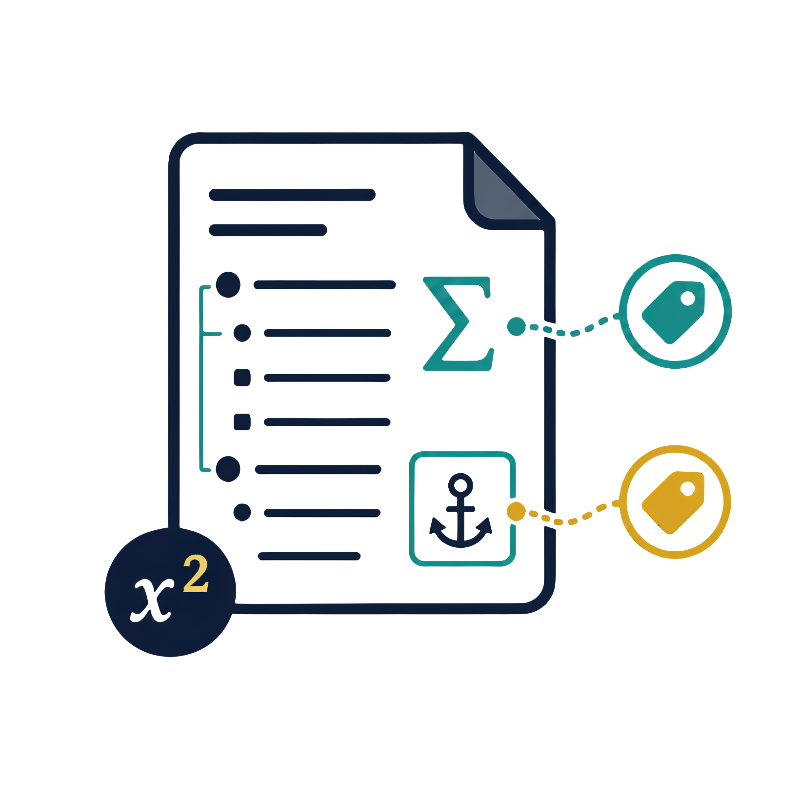
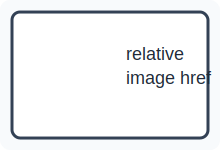

# Pandoc Manuscript Tools F5 Test Document {#sec:test-document}

This file is the smoke-test manuscript opened from the Extension Development Host. It intentionally contains many small Markdown and Pandoc-crossref patterns so each extension feature can be tested in one place.

## Quick Test Checklist {#sec:quick-test}

Use these targets after pressing F5:

1. Ctrl-click or run Go to Definition on @sec:methods, @fig:single-panel, @fig:multi-panel, @tbl:metrics, and @eq:objective.
2. Run Find All References on `{#eq:objective}` or any `@eq:objective` reference.
3. Hover over @eq:objective, @tbl:metrics, image labels, table labels, and section labels.
4. Hover inside the display equations in @eq:objective and @eq:bracket-objective, and the inline math spans $a^2 + b^2 = c^2$ and \( \nabla_\theta J(\theta) \).
5. Hover over the SVG and EMF image fixtures in @fig:svg-preview-fixture, @fig:svg-relative-image-fixture, and @fig:emf-preview-fixture.
6. Open Outline and confirm heading labels, figure labels, table labels, equation labels, and nested subfigure labels are visible.
7. Type `@` in the completion sandbox below and confirm labels from this document appear.
8. Confirm Pandoc fenced divs and bracketed spans have subtle editor background highlights.
9. Confirm ``(Line `quoted text`)`` annotations and `Revision Char` span attributes fold to an ellipsis, then expand when the cursor enters the hidden range.
10. Open Problems and confirm the deliberate undefined reference and duplicate label diagnostics near the end.

Completion sandbox:

@

## Front Matter Is Ignored {#sec:front-matter-note}

The parser should ignore labels and references in YAML front matter. This section is here as a visible reminder; the actual YAML-style block below is fenced as code so it must also be ignored.

```yaml
---
title: Hidden fixture
hidden_label: "{#sec:hidden-yaml-label}"
hidden_reference: "@sec:hidden-yaml-label"
---
```

## Methods {#sec:methods}

This English paragraph is intentionally long enough to trigger the paragraph translation hover when `pandocManuscriptTools.enableParagraphHoverTranslation` is enabled. It also includes inline math such as $f(x)=x^2+1$ and \( \alpha + \beta \) so the optional paragraph-level math preview can be checked after enabling `pandocManuscriptTools.enableInlineMathParagraphHover`.

<!--
This standalone HTML comment checks that hidden manuscript notes can still show
a paragraph translation hover when the cursor is inside the comment block.
-->

The current method uses the section reference @sec:methods, the table reference @tbl:metrics, the figure reference @fig:single-panel, and the equation reference @eq:objective in one paragraph. Bracketed references should behave the same: [@sec:results; @tbl:metrics; @eq:normal-equation].

Inline code spans should not become math hovers: `$not_math$`, `\(not_math\)`, `@sec:not-a-reference-in-code`, and `{#fig:not-a-label-in-code}`.

### Display Math {#sec:display-math}

The next equation uses the Pandoc-crossref closing-delimiter label style.

$$
J(\theta) = \frac{1}{n}\sum_{i=1}^{n}\left(y_i - x_i^\top\theta\right)^2 + \lambda\lVert\theta\rVert_2^2
$$ {#eq:objective}

The normal equation in @eq:normal-equation checks a second display math label and another Go to Definition target.

$$
\hat{\theta} = \left(X^\top X + \lambda I\right)^{-1}X^\top y
$$ {#eq:normal-equation}

The following display equation uses LaTeX `\\[` and `\\]` delimiters.

\[
\mathcal{L}(\theta) = \sum_{i=1}^{n}\ell\left(y_i, f_\theta(x_i)\right)
\] {#eq:bracket-objective}

An unlabeled display equation should still render a hover preview, but it should not create a cross-reference target.

$$
\int_0^1 x^2\,dx = \frac{1}{3}
$$

### Lists For Paragraph Hover Translation {#sec:list-hover}

- This first item contains inline math $p < 0.05$ and should keep list shape in the translated hover.
- This second item references @eq:objective and @tbl:metrics.
  - This nested item checks indentation preservation for simple list translation.

1. Ordered item one uses \( \mu = 0 \).
2. Ordered item two points back to @sec:methods.

## Tables {#sec:tables}

The main table in @tbl:metrics checks table labels, table hovers, completion, references, and the Outline.

| Method | Accuracy | Loss |
|---|---:|---:|
| Baseline | 0.812 | 0.431 |
| Proposed | **0.934** | **0.128** |

: Metrics table with inline math in the caption, $L_2$, and a Pandoc label. {#tbl:metrics}

The next one-column table is a compact pseudocode-style fixture. It should still parse the table caption label and preserve escaped pipes inside cells.

| Algorithm step |
|---|
| 1.\ \ Load records and remove rows where `status \| flag` is missing. |
| 2.\ \ Compute score $s_i = w^\top x_i$. |
| 3.\ \ Report results through @tbl:metrics. |

: Pseudocode-style one-column table fixture. {#tbl:pseudocode}

The table below intentionally has a pipe-table shape suitable for paragraph translation hover tests.

| Field | Meaning |
|---|---|
| sample | The current observation with value $x_i$. |
| score | The computed value used by @eq:objective. |

: Translation-friendly table paragraph fixture. {#tbl:hover-translation-table}

## Figures {#sec:figures}

The single image below uses a real local file from the extension repository so Markdown preview can render it while the parser sees `{#fig:single-panel}`.

{#fig:single-panel width=30%}

The next two images exercise the SVG and EMF hover preview paths with small local assets from the extension repository.

{#fig:svg-preview-fixture width=20%}

{#fig:svg-relative-image-fixture width=20%}

{#fig:emf-preview-fixture width=20%}

The HTML div below checks parent figure labels and nested subfigure labels. In the Outline, @fig:subfigure-a and @fig:subfigure-b should be children of @fig:multi-panel.

<div id="fig:multi-panel">

{#fig:subfigure-a width=30%}

{#fig:subfigure-b width=30%}

Multi-panel figure caption fixture.

</div>

## Fenced Divs {#sec:fenced-divs}

The parser tracks Pandoc fenced div ranges for editor highlighting. This block also checks that normal references inside fenced div content still work.

::: {.note}
This fenced div references @sec:methods, @fig:multi-panel, @tbl:pseudocode, and @eq:objective.

:::: {.nested}
Nested fenced div content references @fig:subfigure-a.
::::
:::

## Bracketed Spans {#sec:bracketed-spans}

The parser tracks Pandoc bracketed spans for inline editor highlighting. This sentence contains [Get out]{custom-style="*"} as a compact custom-style fixture, [an emphatic phrase]{custom-style="Revision Char"} as an attribute-folding fixture, and [a visible named style]{custom-style="Emphatically"} as a non-folding fixture. Only the `Revision Char` attribute block should collapse to an ellipsis, and it should expand when the cursor enters it.

The ordinary Markdown link [Pandoc](https://pandoc.org){#not-a-span-highlight}, the image fixture {custom-style="NotASpan"}, and the code span `[Code text]{custom-style="NotASpan"}` should not receive the bracketed span highlight.

## Inline Line Excerpt Folding {#sec:inline-line-excerpt-folding}

This annotation should fold only the quoted content to an ellipsis: (Line `The experimental procedure consists of four main stages`). Moving the cursor into the code span should reveal the full sentence for editing.

This ordinary code span must remain visible because it is not a line annotation: `The experimental procedure consists of four main stages`.

## Ignored Regions {#sec:ignored-regions}

Labels and references inside code fences should not affect diagnostics, completions, references, or duplicate detection.

```markdown
# Hidden Heading {#sec:hidden-code-heading}

This fake reference @sec:hidden-code-heading and fake equation label {#eq:hidden-code-equation} should be ignored.

$$
x = y
$$ {#eq:hidden-code-equation}
```

The fake labels above should not appear in completion after `@`.

## Results {#sec:results}

This results paragraph references @sec:methods, @tbl:metrics, @tbl:pseudocode, @fig:single-panel, @fig:multi-panel, @fig:subfigure-a, @fig:subfigure-b, @eq:objective, and @eq:normal-equation. It gives Find All References enough matches to be useful.

Another paragraph checks repeated references: @eq:objective appears again, @eq:objective appears a third time, and @tbl:metrics appears again.

## Diagnostics Playground {#sec:diagnostics}

The next reference is deliberately undefined and should show a warning in Problems: @fig:missing-panel.

The next two labels are deliberately duplicated and should show information diagnostics:

{#fig:duplicate-fixture width=20%}

{#fig:duplicate-fixture width=20%}

The duplicated label is referenced here so hover counts can also be checked: @fig:duplicate-fixture.

## Final Cross-Reference Sweep {#sec:final-sweep}

Use this dense sentence for quick navigation checks: @sec:test-document, @sec:quick-test, @sec:display-math, @sec:tables, @sec:figures, @sec:fenced-divs, @sec:bracketed-spans, @sec:ignored-regions, @sec:results, @sec:diagnostics, @tbl:metrics, @tbl:pseudocode, @tbl:hover-translation-table, @fig:single-panel, @fig:multi-panel, @fig:subfigure-a, @fig:subfigure-b, @eq:objective, and @eq:normal-equation.
